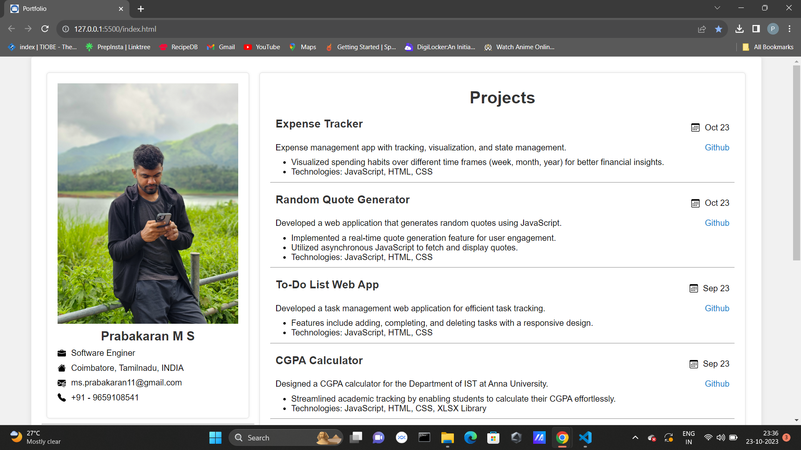

# Portfolio - Prabakaran M S

This is my personal portfolio website, showcasing my skills, projects, and educational background. Feel free to explore the content and get in touch with me.

## Projects

### Expense Tracker
- Developed an expense management app with tracking, visualization, and state management.
- Visualized spending habits over different time frames (week, month, year) for better financial insights.
- Technologies: JavaScript, HTML, CSS
- [GitHub Repository](https://github.com/Prabakaran-MS/Expense-Tracker)

### Random Quote Generator
- Created a web application that generates random quotes using JavaScript.
- Implemented real-time quote generation for user engagement.
- Utilized asynchronous JavaScript to fetch and display quotes.
- Technologies: JavaScript, HTML, CSS
- [GitHub Repository](https://github.com/Prabakaran-MS/Random-Quote-Generator)

### To-Do List Web App
- Developed a task management web application for efficient task tracking.
- Features include adding, completing, and deleting tasks with a responsive design.
- Technologies: JavaScript, HTML, CSS
- [GitHub Repository](https://github.com/Prabakaran-MS/To-Do-list-Web-App)

### CGPA Calculator
- Designed a CGPA calculator for the Department of IST at Anna University.
- Streamlined academic tracking by enabling students to calculate their CGPA effortlessly.
- Technologies: JavaScript, HTML, CSS, XLSX Library
- [GitHub Repository](https://github.com/Prabakaran-MS/Au-Cgpa-Calculator)

## Skills

- HTML5
- CSS3
- JavaScript
- C
- C++
- Python
- Flask
- Machine Learning
- MySQL

## Languages

- Tamil
- English

## Contact

- Email: ms.prabakaran11@gmail.com
- Phone: +91 - 9659108541

## Find Me on Social Media

- [Instagram](https://www.instagram.com/prabakaran.ms/)
- [GitHub](https://github.com/Prabakaran-MS)
- [LinkedIn](https://www.linkedin.com/in/prabakaran-m-s-897782182/)
